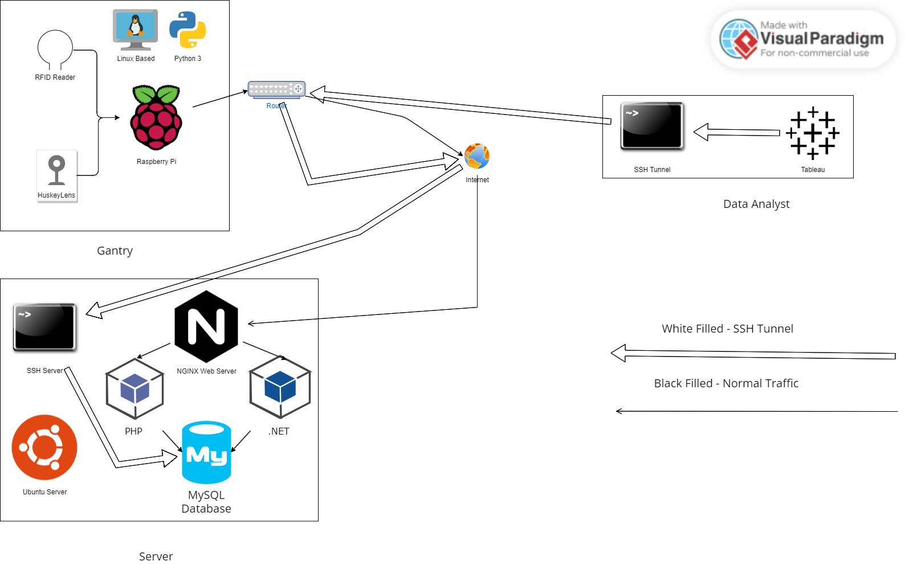

# pfd-gantry
## Overview
This is a repository for our Year 2 Semester 2 module for the course Information Technology called Portfolio Development, where we were tasked to build a project, with the theme 'Data Collection Applications'.
## Software Stack
Here is a diagram we made below.

We used a combination of different types of software to get the whole solution working properly and working together. What we have used will be listed below.
1. [MySQL](./dbfiles/) (Database to store all entry and exit records)
2. [PHP](./php-code/) (Server end API)
3. ASP.NET (Admin Console (for changing password and all, and listing company records))
4. Linux (Gantry and Server end)
5. [Python](./pi-client/) (For the gantry end software)
6. [NGINX](./nginx-rules/) (routing main web traffic to the above PHP and ASP.NET)
7. [Tableau](./tableau_workbook/) (for data analyst to decipher information) (not pictured above)
## More Information
More information about this project can be found on weekly blog [here](https://leezhiwei.github.io/pfd-blog).
